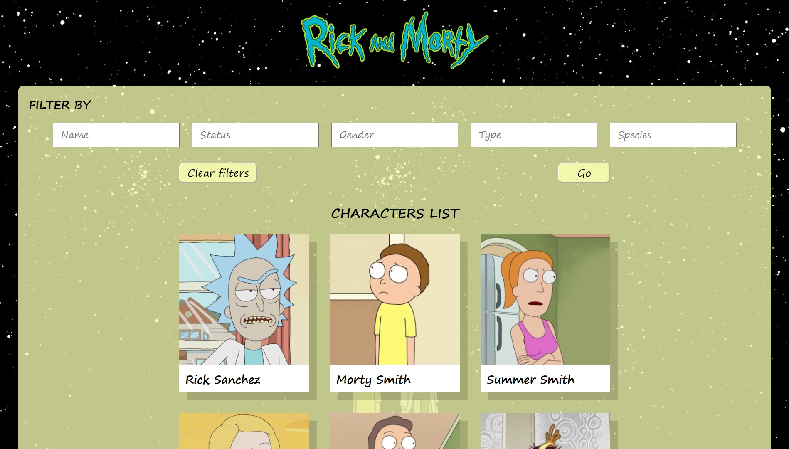

# «Rick and Morty»

### Описание: Адаптивное приложение для поиска информации о персонажах мультфильма «Rick and Morty»

### Использованные технологии:

- Typescript
- React
- Styled-components
- GraphQL
- Babel
- Сборка с помощью Webpack

#### Для запуска на localhost использовать команду:

```
npm run start
```

<!--   -->

